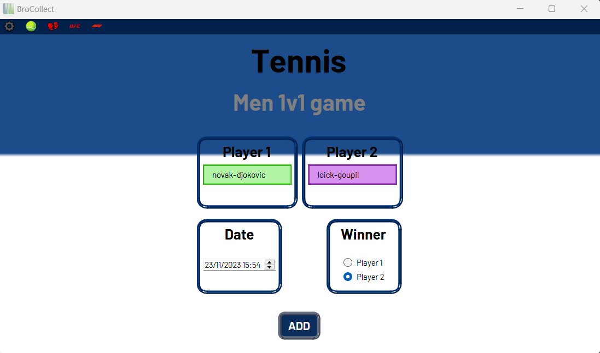

# BroCollect V2.0

**@version:** 2.0  
**@author:** BoxBoxJason

## Context
BroCollect's purpose is to collect data and build a database with sports events results. It caters to various sports involving player vs. player competition, including:
- 1v1 games (e.g., tennis, boxing, chess...)
- Free-for-all games (e.g., horse race, F1, sprinting...)
- Team games (e.g., football, baseball, rugby...)

## User Guide
To launch BroCollect:
1. Run the `__main__.py` file with any Python 3.10 interpreter.
2. This will start BroCollect in its installed version, displaying the HMI.

### Welcome Page

Select the sport you want using the top navigation bar
### 1v1 Collection

Fill your game settings
### FFA Collection

### Team Collection

## Technical Summary
- **Python Version:** 3.10
- **Requirements:**
  - Install PyQt6 on your local Python machine.
  - Set up a "Results" folder at the same level as `__main__.py` (with at least read permissions).
- The "Results" folder will store the collected data in the correct format for use by GamBible.
- **Important:** Never manually alter the content in the generated json files.

- **Database:** .json files are used as databases. Be careful, data could be lost if the program is interrupted during overwrite time.